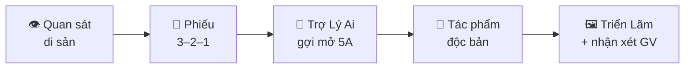

<div align="center">

# 🏛️ SMART ART HERITAGE

### Hệ sinh thái Mĩ thuật số thông minh — Khám phá di sản Hưng Yên cùng AI

**Mĩ thuật THCS • No Observation → No AI • 100% client-side, không cần cài đặt**

[](index.html) [](di-san.html) [](models.html) [](trien-lam.html)


</div>

---

## ✨ Dự án này là gì?

**Smart Art Heritage** biến di sản ngàn năm của Hưng Yên — Phố Hiến, Chùa Keo, Đền Trần, Lê Quý Đôn, Đồng Xâm — thành **hành trình mĩ thuật số tương tác** cho học sinh THCS:

> 👁️ *Học sinh quan sát thật → ghi cảm nhận 3–2–1 → sáng tạo tác phẩm của riêng mình, với Trợ Lý Ai chỉ gợi mở — **không bao giờ vẽ thay học sinh**.*

Nguyên tắc vàng của dự án: **NO OBSERVATION → NO AI.** Muốn AI gợi ý trước, phải quan sát trước.

## 🗺️ Các trang trong hệ thống

**⭐ Hành trình tích hợp trên MỘT trang:** [Trang chủ](index.html) giờ là một bài học liền mạch theo đúng tệp mẫu V3.8 — chọn hồ sơ di sản → 15 ảnh tư liệu + bộ câu hỏi quan sát → Phiếu 3–2–1 → Xưởng AI 5A → Triển lãm, **tất cả ngay trong một trang, một lựa chọn di sản dùng chung cho mọi bước** (không nhảy trang, không mất dữ liệu giữa các bước).

| Trang | Dành cho | Nội dung |
|---|---|---|
| 🏠 [Trang chủ — Hành trình tích hợp](index.html) | Học sinh | **Một trang duy nhất:** hồ sơ di sản → quan sát & câu hỏi → 3–2–1 → AI 5A → triển lãm |
| 🏛️ [Di Sản & Câu Hỏi](di-san.html) | Học sinh | Trang riêng 5 quần thể di sản với 75 điểm chạm Hotspot (chuyển sang hành trình tích hợp khi chọn hồ sơ) |
| 🧊 [Phòng 3D](models.html) | Học sinh | Mô hình 3D Gác Chuông Chùa Keo xoay – zoom trực tiếp trên web |
| 📝 [Phiếu 3–2–1](phieu-3-2-1.html) | Học sinh | Trang riêng của phiếu tư duy (tiếp tục sang AI 5A trong trang tích hợp) |
| 🤖 [Trợ Lý Ai](tro-ly-ai.html) | Học sinh | Trang riêng chat 5A: Ask – Analyze – Advise – Adapt – Art |
| 🖼️ [Triển Lãm](trien-lam.html) | Cả lớp | Tải tác phẩm lên, xem điểm ★ và nhận xét của giáo viên |
| 👩‍🏫 [Trang Quản Trị](giao-vien.html) | Giáo viên | Chấm rubric, phản hồi, thống kê lớp, xuất CSV, kết nối API AI |

## 🎓 Hành trình của học sinh



Cả năm bước trên nằm **liền nhau trong một trang** ([index.html](index.html)) — học sinh cuộn xuống là tới bước tiếp theo, giống hệt tệp mẫu V3.8. Các trang riêng vẫn giữ lại cho dạy học theo từng phần.

## 🤖 Trợ Lý Ai hoạt động thế nào?

Trang chat của học sinh cố gắng trả lời thật **ngay trong khung chat** theo thứ tự ưu tiên:

1. **🔌 API của giáo viên** — giáo viên dán *bất kỳ* API tương thích OpenAI nào (OpenAI, Groq miễn phí, OpenRouter, LM Studio, Ollama…) vào Trang Quản Trị: base URL + key + tên mô hình. Key chỉ lưu trên máy của giáo viên và gửi thẳng tới API khi chat.
2. **📜 Kịch bản 5A offline** — nếu chưa kết nối API hoặc API lỗi, chat **không bao giờ treo**: tự quay về kịch bản sư phạm có sẵn.

Đúng nguyên tắc **NO OBSERVATION → NO AI**: hệ thống chỉ mở Trợ Lý Ai sau khi học sinh đã điền Phiếu 3–2–1.

## 📊 Chấm điểm & phản hồi (cho giáo viên)

- **Rubric 4 tiêu chí** (0–10 mỗi tiêu chí): Nhận thức di sản · Ý tưởng sáng tạo · Kỹ thuật tạo hình · Tính thẩm mĩ
- **Thống kê lớp**: số bài đã chấm, điểm trung bình, bài cao nhất – thấp nhất
- **Lọc & tìm kiếm** nhanh theo trạng thái, học sinh, lớp, di sản
- **Gợi ý nhận xét** theo mức điểm — một cú bấm là có lời nhận xét phù hợp
- **Xuất CSV** đầy đủ điểm từng tiêu chí để nhập sổ
- Điểm ★ và **nhận xét của giáo viên hiện ngay trên tác phẩm** của học sinh ở Triển Lãm

## 🚀 Chạy dự án

Không cần build, không cần cài đặt — đây là trang web tĩnh thuần HTML/CSS/JS:

```bash
# Cách 1: mở thẳng file
open index.html

# Cách 2: chạy máy chủ cục bộ (khuyên dùng)
python3 -m http.server 8080
# rồi truy cập http://localhost:8080
```

## 🔐 Đăng nhập giáo viên lần đầu

| Tên đăng nhập | Mật khẩu mặc định |
|---|---|
| `giaovien` | `sahogiuday` |

⚠️ Hãy **đổi mật khẩu ngay** trong tab *Bảo mật* sau lần đăng nhập đầu tiên. Toàn bộ dữ liệu (học sinh, tác phẩm, điểm, nhật ký) chỉ lưu trên máy này — không gửi đi đâu cả.

## 🛠️ Công nghệ

- **Thuần HTML + CSS + JavaScript** — không framework, không build step
- **Three.js** (qua `vendor/`) — phòng xem 3D WebGL
- **localStorage / sessionStorage** — lưu trữ 100% trên máy người dùng
- **Google Fonts** — Plus Jakarta Sans

## 📁 Cấu trúc thư mục

```
smart-art-heritage/
├── index.html                  # HÀNH TRÌNH TÍCH HỢP: di sản → 3–2–1 → AI 5A → triển lãm
├── di-san.html                 # 5 quần thể di sản + hotspot
├── models.html                 # Phòng 3D WebGL
├── phieu-3-2-1.html            # Phiếu tư duy 3–2–1
├── tro-ly-ai.html              # Trợ Lý Ai — chat 5A
├── trien-lam.html              # Triển lãm tác phẩm
├── giao-vien.html              # Quản trị cho giáo viên
├── css/smart-art-heritage.css  # Toàn bộ giao diện (giao diện "bảo tàng sáng")
├── js/smart-art-heritage.js    # Engine dùng chung
├── js/content-studio.js        # Bộ sửa nội dung cho giáo viên (xem mục dưới)
├── content/published.json      # Bản giáo viên đã xuất bản — học sinh đọc tệp này
├── content/library/designs.json# Thư viện thiết kế mẫu đóng gói kèm
├── tools/build_index.py        # Sinh index.html từ bản gốc
├── tools/content_api.py        # API nhỏ để "Xuất bản" (thư viện chuẩn Python)
├── 3d/                         # Mô hình & texture 3D
└── assets/                     # Ảnh di sản, dữ liệu heritage
```

## 🧱 Sinh lại `index.html`

`index.html` **được sinh ra, không viết tay**. Tệp nguồn là bản gốc tổng hợp mới nhất
(`new 9_10_2026.html` — đã gồm trình sửa hotspot `sahed`, mục `#p321V312`, bản vá nội dung
AI 5A và các khối trợ giúp `<details>`):

```bash
python3 tools/build_index.py
```

Script sẽ thay 155 ảnh base64 bằng ảnh thật trong `assets/extracted/`, bỏ khối `#auditV311`,
phục hồi phần mà bản gốc làm mất (chọn “lần thử” trong Xưởng phác thảo, chỉ số gói 3–2–1),
kiểm tra mọi sửa lỗi của bản gốc còn nguyên, rồi nối `js/restored-modules.js` và phần nối
`#journey39` vào cuối trang. Script tự báo lỗi nếu bản gốc thiếu hoặc khác đi — vì vậy hãy
sửa ở bản gốc rồi chạy lại, **đừng sửa trực tiếp `index.html`**.

## ✏️ Giáo viên sửa nội dung cho học sinh

**Giáo viên không phải bấm nút nào cả.** Bấm vào một câu trên trang, gõ chữ mới, bấm **✅ Xong**
(thậm chí chỉ cần bấm sang câu khác) — vài giây sau học sinh đã thấy bài mới. Không có tệp nào
phải tải lên, không có mã nào phải dán, không có bước “lưu nháp” rồi “xuất bản”.

Điều kiện duy nhất: máy đó **đã đăng nhập một lần** bằng mật khẩu chung của tổ chuyên môn.
Chưa đăng nhập thì trang vẫn cho sửa (bài nằm chờ trên máy), và tự đưa lên ngay khi đăng nhập.

Mở bộ công cụ bằng một trong hai cách:

- Trang Quản Trị → nút **✏️ Nội dung & thiết kế**
- Hoặc mở thẳng `index.html?studio=1` (cũng dùng được cho `trien-lam.html?studio=1`)

### Thanh công cụ

| Nút | Việc nó làm |
|---|---|
| **✏️ Sửa nội dung** | Bật/tắt chế độ sửa. Khi bật, rà chuột thấy câu nào sửa được, bấm vào là mở hộp sửa. Phím tắt: `Ctrl/Cmd + Shift + E` |
| **👁 Xem như học sinh** | Xem đúng những gì học sinh đang thấy, thay vì bản đang sửa |
| **↩️ Hoàn tác** | Trả lại nội dung vừa sửa (một lần, cho lần sửa gần nhất) |
| **câu trạng thái** | *Đang lưu… / ✓ Học sinh đang thấy bản này / … Chưa gửi lên / ⚠ Chưa đăng nhập / ⚠ Chưa lưu được.* Chỉ khi có việc để làm thì câu này mới gạch chân và bấm được (đăng nhập, hoặc thử gửi lại) |
| **➕ Thêm** | Tìm câu chữ cần sửa • Ẩn/hiện từng phần • Thư viện thiết kế • Quay lại bản trước • Đăng nhập/đăng xuất |

Hộp sửa một câu chỉ có **✅ Xong**, **↩️ Trả lại như cũ** và **Đóng** — gõ tới đâu trang hiện tới
đó, và chữ đã gõ không bao giờ mất: đóng hộp bằng cách nào cũng tự lưu.

### Cách hoạt động (và vì sao đáng tin)

- **Sửa theo ô chữ, không phải cả khối.** Một câu hỏi thường nằm lẫn với `<b>`, `<textarea>`,
  `<details>`; bộ công cụ chỉ đổi đúng đoạn chữ nên cấu trúc trang giữ nguyên.
- **Mỗi ô gắn với nội dung gốc của nó.** Bản sửa chỉ áp dụng khi nội dung gốc vẫn còn nguyên ở
  đúng chỗ. Nhờ vậy sửa câu hỏi gói 1 của Phố Hiến sẽ không dán nhầm sang gói của Chùa Keo, và
  nếu sau này bản gốc đổi chữ thì bản sửa “trượt” — bản sửa nằm im chứ không âm thầm sửa sai.
- **Nội dung do JavaScript sinh ra vẫn giữ bản sửa.** Khi học sinh đổi dự án/gói, câu hỏi bị vẽ
  lại từ dữ liệu; bộ công cụ đắp bản sửa trở lại ngay trong cùng nhịp nên không thấy nội dung cũ.
- **Không nháy nội dung cũ.** Bản đã đưa lên được nhớ trên máy người xem và áp dụng trước khi
  trình duyệt vẽ trang.
- **Một thao tác duy nhất khi sửa xong, không có bước riêng để “lưu”.** Đóng hộp sửa bằng cách
  nào — bấm ✅ Xong, bấm sang câu khác, gõ Esc, hay thậm chí đóng tab — cũng đều lưu ngay tại chỗ
  rồi gửi lên (khi đóng tab thì yêu cầu gửi đi theo kiểu `keepalive` nên không mất chữ).
- **Chỉ máy đã đăng nhập mới gửi được.** Học sinh vẫn chỉ đọc `content/published.json`; máy chưa
  đăng nhập thì bài nằm chờ trên máy đó và tự đi ngay khi đăng nhập — máy chủ trả **401** cho người lạ.

### Xuất bản

```bash
# Cài dịch vụ (một lần, trên máy chủ có nginx). Dịch vụ chạy dưới tài khoản www-data,
# nên tệp mã PHẢI thuộc www-data VÀ thư mục /etc/sah-content-api phải cho www-data
# đi qua. Thiếu một trong hai thì mọi lần xuất bản trả về 503 dù mã đã đúng.
install -d -m 755 -o root -g root /opt/sah-content-api
install -m 755 tools/content_api.py /opt/sah-content-api/content_api.py
install -d -m 750 -o root -g www-data /etc/sah-content-api
install -o www-data -g www-data -m 600 content/.publish-token.local /etc/sah-content-api/token
# Mật khẩu chung của tổ giáo viên (xem mục “Đăng nhập” bên dưới)
install -o www-data -g www-data -m 600 content/.teacher-password.local /etc/sah-content-api/password
install -d -m 755 -o www-data -g www-data /var/www/smart-art-heritage/content/history
cp tools/sah-content-api.service /etc/systemd/system/
systemctl daemon-reload && systemctl enable --now sah-content-api
systemctl is-active sah-content-api && curl -s 127.0.0.1:8788/api/health
```

Khối dịch vụ đầy đủ nằm ở `tools/sah-content-api.service`. Dịch vụ chỉ nghe trên
`127.0.0.1:8788`, nginx chuyển tiếp tại `/api/`. Cần thêm vào máy chủ:

```nginx
# ^~ để quy tắc chặn tệp ẩn ở dưới KHÔNG chặn mất đường gia hạn chứng chỉ TLS
location ^~ /.well-known/acme-challenge/ { root /var/www/html; }
location /api/ { proxy_pass http://127.0.0.1:8788; client_max_body_size 4m; }
location = /content/published.json { add_header Cache-Control "no-cache, must-revalidate"; }
# không bao giờ phục vụ tệp ẩn (content/.publish-token.local là mã xuất bản!)
location ~ (^|/)\. { deny all; }
# bản lưu cũ chỉ xem qua /api/content/history, không xem qua HTTP
location ^~ /content/history/ { deny all; }
```

Mẫu `(^|/)\.` chỉ khớp dấu chấm **ngay sau** dấu `/` hoặc đầu chuỗi, nên
`/js/content-studio.js` và `/assets/…` vẫn phục vụ bình thường. Đừng dùng `location ~ /\.`
(mọi đường dẫn đều khớp) và đừng bỏ `^~` ở dòng ACME — bỏ đi thì việc gia hạn chứng chỉ TLS
sẽ hỏng trong im lặng.

| Đường dẫn | Việc |
|---|---|
| `GET /api/health` | Trạng thái dịch vụ |
| `GET /api/session` | Máy này đã đăng nhập chưa, và phiên còn tới khi nào |
| `POST /api/login` | Đổi mật khẩu giáo viên lấy cookie đăng nhập |
| `POST /api/logout` | Xoá phiên trên máy đang dùng |
| `GET /api/content` | Bản đã xuất bản |
| `POST /api/content` | Ghi nội dung một trang — **cần `Authorization: Bearer <mã>`** |
| `GET /api/content/history` | Danh sách bản lưu cũ |
| `POST /api/content/restore` | Quay lại một bản lưu cũ |

### 🔐 Đăng nhập giáo viên — không phải dán mã mỗi máy

Giáo viên **không** dán mã xuất bản. Mở **➕ Thêm › Đăng nhập** và nhập **mật khẩu chung của tổ chuyên môn** một
lần trên mỗi máy: máy chủ trả về cookie `HttpOnly`, nên **trình duyệt** (không phải trang web) giữ
phiên trong 90 ngày và JavaScript không đọc được phiên đó. Những lần sau mở trang là đã đăng nhập
sẵn; nút **Đăng xuất máy này** nằm ngay trong hộp thoại.

```bash
# Sinh mật khẩu dễ đọc cho tổ chuyên môn rồi cài lên máy chủ
python3 -c "import secrets;w='sen-lua-to-dong-cham-bac-trong-nuoc-huong-mai-que'.split('-');print('-'.join(secrets.choice(w) for _ in range(4))+'-'+str(secrets.randbelow(90)+10))" > content/.teacher-password.local
install -o www-data -g www-data -m 600 content/.teacher-password.local /etc/sah-content-api/password
systemctl restart sah-content-api && curl -s 127.0.0.1:8788/api/health
```

Đổi mật khẩu: ghi lại `/etc/sah-content-api/password` rồi `systemctl restart sah-content-api`.
Cách này **không** thu hồi các phiên đã cấp, nên nếu nghi mật khẩu bị lộ thì xoá
`/var/lib/sah-content-api/sessions.json` và khởi động lại — khi đó mọi máy phải đăng nhập lại.

Vài điểm an toàn đã kiểm chứng trên chính máy chủ này:

- Cookie có `HttpOnly` + `SameSite=Lax` + `Path=/api`, phiên 90 ngày.
- Vì trình duyệt tự gửi cookie kèm mọi yêu cầu, thay đổi chỉ được nhận khi yêu cầu đến từ chính
  trang này: gửi kèm `Origin` lạ bị **403** (chống CSRF). Script đi bằng mã Bearer không dính.
- Nhập sai quá 12 lần trong 5 phút → **429**.
- Phiên nằm ở `/var/lib/sah-content-api/sessions.json`, **ngoài** thư mục web phục vụ, và không
  bao giờ nằm trong `localStorage` của giáo viên.

Mã xuất bản ở `content/.publish-token.local` (**đã bị `.gitignore` bỏ qua** — không commit, không
dán vào chat) vẫn dùng được cho script: nhập vào mục **⚙️ → Nâng cao**, hoặc gửi
`Authorization: Bearer <mã>`. Đổi mã: sửa `/etc/sah-content-api/token` rồi `systemctl restart
sah-content-api`.

Mỗi lần xuất bản đều lưu một bản cũ vào `content/history/` (giữ 60 bản gần nhất) để còn quay lại.
Ghi tệp theo kiểu “tệp tạm rồi đổi tên”, nên học sinh đang tải trang không bao giờ đọc phải tệp dở.

Nếu chưa cài API, nút **Xuất bản** sẽ mời tải tệp `.json` để tự chép lên máy chủ — bộ công cụ
vẫn dùng được đầy đủ ở chế độ nháp.

### Giới hạn cần biết

- **Bản nháp nằm trên máy giáo viên** (localStorage). Muốn dùng ở máy khác, lưu vào Thư viện rồi
  ⬇ tải tệp, hoặc đăng nhập cùng trình duyệt đó.
- **Bản đã xuất bản là dùng chung**: một tệp `content/published.json` cho cả trường, không tách
  theo lớp. Giáo viên dạy song song nên thống nhất nội dung trước khi bấm Xuất bản.
- **Bản trên GitHub Pages** chỉ đọc được, không ghi được: muốn xuất bản từ đó thì nhập địa chỉ máy
  chủ vào **⚙️ → Nâng cao** (máy chủ đã cho phép CORS cho tên miền Pages). Lưu ý cookie đăng nhập
  **không** đi qua tên miền khác, nên ở bản Pages phải dùng mã xuất bản chứ không đăng nhập được.
- **Phiên đăng nhập là theo máy.** Đổi mật khẩu không tự đăng xuất các máy đang nhớ phiên; muốn
  thu hồi hết thì xoá `/var/lib/sah-content-api/sessions.json` rồi khởi động lại dịch vụ.

## 📄 Giấy phép

Dự án phục vụ dạy và học. © 2026 Smart Art Heritage — Hệ sinh thái Mĩ thuật số di sản Việt Nam.

<div align="center">

**Mảnh đất Hưng Yên — Đất học, đất nghề, đất tài.**

</div>
