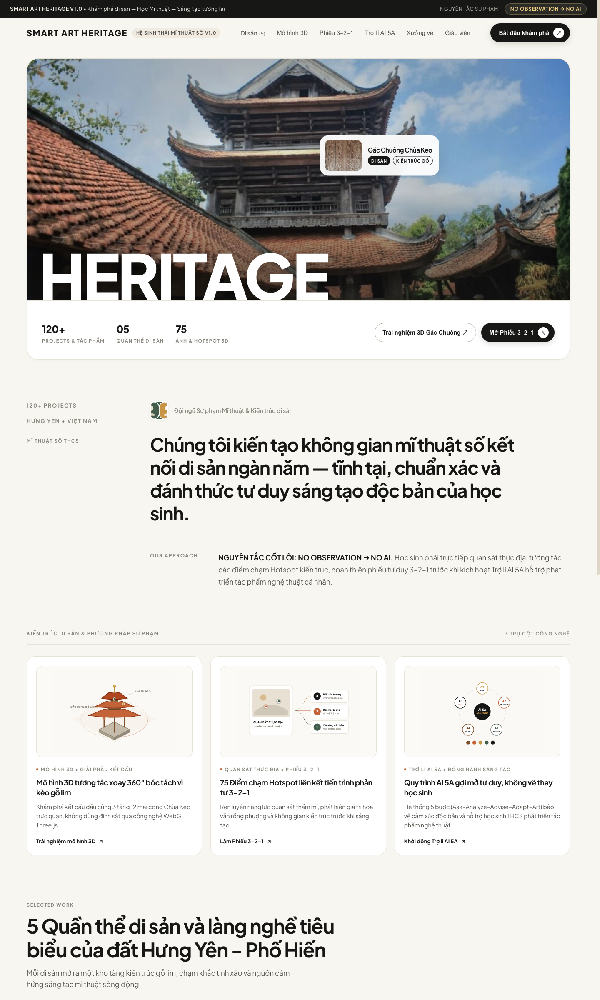
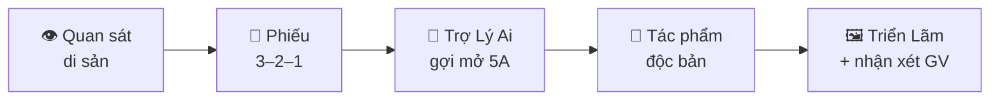

<div align="center">

# 🏛️ SMART ART HERITAGE

### Hệ sinh thái Mĩ thuật số thông minh — Khám phá di sản Hưng Yên cùng AI

**Mĩ thuật THCS • No Observation → No AI • 100% client-side, không cần cài đặt**

[](index.html) [](di-san.html) [](models.html) [](trien-lam.html)



</div>

---

## ✨ Dự án này là gì?

**Smart Art Heritage** biến di sản ngàn năm của Hưng Yên — Phố Hiến, Chùa Keo, Đền Trần, Lê Quý Đôn, Đồng Xâm — thành **hành trình mĩ thuật số tương tác** cho học sinh THCS:

> 👁️ *Học sinh quan sát thật → ghi cảm nhận 3–2–1 → sáng tạo tác phẩm của riêng mình, với Trợ Lý Ai chỉ gợi mở — **không bao giờ vẽ thay học sinh**.*

Nguyên tắc vàng của dự án: **NO OBSERVATION → NO AI.** Muốn AI gợi ý trước, phải quan sát trước.

## 🗺️ Các trang trong hệ thống

**⭐ Hành trình tích hợp trên MỘT trang:** [Trang chủ](index.html) giờ là một bài học liền mạch theo đúng tệp mẫu V3.8 — chọn hồ sơ di sản → 15 ảnh tư liệu + bộ câu hỏi quan sát → Phiếu 3–2–1 → Xưởng AI 5A → Triển lãm, **tất cả ngay trong một trang, một lựa chọn di sản dùng chung cho mọi bước** (không nhảy trang, không mất dữ liệu giữa các bước).

| Trang | Dành cho | Nội dung |
|---|---|---|
| 🏠 [Trang chủ — Hành trình tích hợp](index.html) | Học sinh | **Một trang duy nhất:** hồ sơ di sản → quan sát & câu hỏi → 3–2–1 → AI 5A → triển lãm |
| 🏛️ [Di Sản & Câu Hỏi](di-san.html) | Học sinh | Trang riêng 5 quần thể di sản với 75 điểm chạm Hotspot (chuyển sang hành trình tích hợp khi chọn hồ sơ) |
| 🧊 [Phòng 3D](models.html) | Học sinh | Mô hình 3D Gác Chuông Chùa Keo xoay – zoom trực tiếp trên web |
| 📝 [Phiếu 3–2–1](phieu-3-2-1.html) | Học sinh | Trang riêng của phiếu tư duy (tiếp tục sang AI 5A trong trang tích hợp) |
| 🤖 [Trợ Lý Ai](tro-ly-ai.html) | Học sinh | Trang riêng chat 5A: Ask – Analyze – Advise – Adapt – Art |
| 🖼️ [Triển Lãm](trien-lam.html) | Cả lớp | Tải tác phẩm lên, xem điểm ★ và nhận xét của giáo viên |
| 👩‍🏫 [Trang Quản Trị](giao-vien.html) | Giáo viên | Chấm rubric, phản hồi, thống kê lớp, xuất CSV, kết nối API AI |

## 🎓 Hành trình của học sinh



Cả năm bước trên nằm **liền nhau trong một trang** ([index.html](index.html)) — học sinh cuộn xuống là tới bước tiếp theo, giống hệt tệp mẫu V3.8. Các trang riêng vẫn giữ lại cho dạy học theo từng phần.

## 🤖 Trợ Lý Ai hoạt động thế nào?

Trang chat của học sinh cố gắng trả lời thật **ngay trong khung chat** theo thứ tự ưu tiên:

1. **🔌 API của giáo viên** — giáo viên dán *bất kỳ* API tương thích OpenAI nào (OpenAI, Groq miễn phí, OpenRouter, LM Studio, Ollama…) vào Trang Quản Trị: base URL + key + tên mô hình. Key chỉ lưu trên máy của giáo viên và gửi thẳng tới API khi chat.
2. **📜 Kịch bản 5A offline** — nếu chưa kết nối API hoặc API lỗi, chat **không bao giờ treo**: tự quay về kịch bản sư phạm có sẵn.

Đúng nguyên tắc **NO OBSERVATION → NO AI**: hệ thống chỉ mở Trợ Lý Ai sau khi học sinh đã điền Phiếu 3–2–1.

## 📊 Chấm điểm & phản hồi (cho giáo viên)

- **Rubric 4 tiêu chí** (0–10 mỗi tiêu chí): Nhận thức di sản · Ý tưởng sáng tạo · Kỹ thuật tạo hình · Tính thẩm mĩ
- **Thống kê lớp**: số bài đã chấm, điểm trung bình, bài cao nhất – thấp nhất
- **Lọc & tìm kiếm** nhanh theo trạng thái, học sinh, lớp, di sản
- **Gợi ý nhận xét** theo mức điểm — một cú bấm là có lời nhận xét phù hợp
- **Xuất CSV** đầy đủ điểm từng tiêu chí để nhập sổ
- Điểm ★ và **nhận xét của giáo viên hiện ngay trên tác phẩm** của học sinh ở Triển Lãm

## 🚀 Chạy dự án

Không cần build, không cần cài đặt — đây là trang web tĩnh thuần HTML/CSS/JS:

```bash
# Cách 1: mở thẳng file
open index.html

# Cách 2: chạy máy chủ cục bộ (khuyên dùng)
python3 -m http.server 8080
# rồi truy cập http://localhost:8080
```

## 🔐 Đăng nhập giáo viên lần đầu

| Tên đăng nhập | Mật khẩu mặc định |
|---|---|
| `giaovien` | `sahogiuday` |

⚠️ Hãy **đổi mật khẩu ngay** trong tab *Bảo mật* sau lần đăng nhập đầu tiên. Toàn bộ dữ liệu (học sinh, tác phẩm, điểm, nhật ký) chỉ lưu trên máy này — không gửi đi đâu cả.

## 🛠️ Công nghệ

- **Thuần HTML + CSS + JavaScript** — không framework, không build step
- **Three.js** (qua `vendor/`) — phòng xem 3D WebGL
- **localStorage / sessionStorage** — lưu trữ 100% trên máy người dùng
- **Google Fonts** — Plus Jakarta Sans

## 📁 Cấu trúc thư mục

```
smart-art-heritage/
├── index.html                  # HÀNH TRÌNH TÍCH HỢP: di sản → 3–2–1 → AI 5A → triển lãm
├── di-san.html                 # 5 quần thể di sản + hotspot
├── models.html                 # Phòng 3D WebGL
├── phieu-3-2-1.html            # Phiếu tư duy 3–2–1
├── tro-ly-ai.html              # Trợ Lý Ai — chat 5A
├── trien-lam.html              # Triển lãm tác phẩm
├── giao-vien.html              # Quản trị cho giáo viên
├── css/smart-art-heritage.css  # Toàn bộ giao diện (giao diện "bảo tàng sáng")
├── js/smart-art-heritage.js    # Engine dùng chung
├── 3d/                         # Mô hình & texture 3D
└── assets/                     # Ảnh di sản, dữ liệu heritage
```

## 📄 Giấy phép

Dự án phục vụ dạy và học. © 2026 Smart Art Heritage — Hệ sinh thái Mĩ thuật số di sản Việt Nam.

<div align="center">

**Mảnh đất Hưng Yên — Đất học, đất nghề, đất tài.**

</div>
